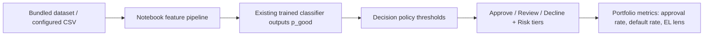

# Credit Risk Decisioning Prototype (Notebook-Based)

## Executive Summary

This repository contains a notebook-based credit underwriting workflow with an added decisioning layer. It reuses existing model outputs to demonstrate **approval thresholds**, **risk tiers**, **decision mapping** (approve / review / decline), a **threshold tradeoff simulation** (approval rate vs default rate among approved), **SHAP explainability**, and a **simple directional loss framing** (avg loan size + LGD assumptions).

**Observed model efficacy (from the notebook analysis):** A simple logistic baseline shows **moderate rank ordering** on the test split (ROC-AUC around **0.66**—better than random, not near-perfect). **Tree-based models** (Random Forest and XGBoost) reach on the order of **~92% accuracy** with **stable cross-validation**, i.e., strong and consistent separation on this workflow’s train/test design. The parallel **interest-rate** regression achieves a **high R² (~0.92)**, consistent with pricing being highly predictable from the available credit-structure features.

**FICO and credit structure:** In exploratory analysis, **Lending Club `sub_grade` is treated as FICO-like (binned credit quality)**; **interest rate and `sub_grade` are ~96% correlated**, which supports the view that **Lending Club’s posted pricing is heavily anchored in FICO-like credit tiers** (the remaining spread still matters competitively). The notebook also notes that **credit rating dominates the interest-rate model** in line with long industry use of FICO-style scores, while **feature-importance rankings can differ by target** (e.g., **inquiries** can rank highly for `loan_status` even when **`sub_grade` is central to rate prediction**). Exact metrics vary slightly with data slice and seed; re-run cells for your copy of the data.

## System Flow

## Business Context

Lenders need more than model scores: they need explicit decision rules that balance approval volume and risk outcomes. This project focuses on translating model output into policy-style decisions and directional business interpretation.

## Problem Statement

- Convert risk scores into actionable underwriting decisions.
- Surface threshold tradeoffs: stricter approvals vs approval volume and observed default rate among approved.
- Add explainability artifacts for model transparency.
- Provide a simple, directional business-loss lens (clarity over precision).

## Solution Overview:

### Predictive modeling

- Existing notebook pipeline: ingestion, cleaning, encoding, scaling, **SMOTE**, and comparison of classifiers (e.g., Logistic Regression, KNN, Random Forest, XGBoost, boosted variants).
- Secondary **interest-rate** regression track for pricing context.
- **No model redesign** in this enhancement: existing trained-model workflow is reused.

### Decision layer

- **`src/decisioning.py`**: maps **P(Fully Paid)** to **prime / near-prime / subprime** tiers and to **approve / review / decline** using configurable thresholds.
- Notebook cells apply these rules on top of **`best_model`** scores on the test split.

### Evaluation framework

- Original metrics: confusion matrix, precision, recall, F1, ROC-AUC, ROC / PR plots.
- **Added**: threshold sweep with **approval rate** and **default rate among approved**, plus optional **expected loss per approved loan** using assumed **average loan amount** and **LGD**.
- **SHAP**: global importance (beeswarm/summary) and one **individual** explanation (waterfall-style where supported).

## Technical Implementation

| Artifact | Role |
|----------|------|
| `Credit_Underwriting_Decisioning-Lending_Club.ipynb` | Existing modeling workflow + added decisioning/simulation/SHAP cells |
| `src/decisioning.py` | Decision tiers, actions, threshold sweep, simple capital helpers |
| `config/policy.default.yaml` | Configurable decision/risk thresholds and LGD assumptions |
| `scripts/run_decisioning.py` | CLI path to apply decision policy outside Jupyter |
| `docs/PORTFOLIO_DECISIONING.md` | Stakeholder-oriented description of the decisioning add-on |
| `docs/RUNBOOK.md` | Day-2 operations: environment, data snapshot, and execution steps |
| `docs/TESTING.md` | Testing and regression workflow documentation |
| `requirements.txt` | Pinned dependencies for reproducible local/CI runs |

**Environment:** Python 3.9.x recommended (per notebook metadata). Configure dataset path via `DATA_PATH` in the notebook.

## Run Book

1. Install dependencies:
   - `pip install -r requirements.txt`
2. Run tests (fast local path):
   - `pytest`
3. Run full notebook execution test:
   - `pytest --run-notebook`
4. Run notebook manually:
   - open `Credit_Underwriting_Decisioning-Lending_Club.ipynb`
   - ensure data resolves from `data/loans.csv` (or set `LENDING_CLUB_DATA_PATH`)
5. Optional non-notebook decisioning run:
   - `python scripts/run_decisioning.py --scores-csv <path_to_scores_csv>`

Bundled dataset note: this repo includes a public Lending Club sample at `data/loans.csv` (sample subset from 2014-era source mirror).
For more operational detail, see `docs/RUNBOOK.md`.

## Testing and Regression Framework

- `pytest`-based test suite with strict markers (`unit`, `smoke`, `regression`, `notebook_e2e`)
- Unit coverage for decision-layer logic in `src/decisioning.py`
- Notebook **schema** checks plus bundled `data/loans.csv` presence; optional **full execution** via `nbconvert` (see `docs/TESTING.md`)
- Deterministic model smoke test to ensure ML pipeline health in local environment
- Baseline-driven regression test using `tests/baselines/model_quality_baseline.json`
- See `docs/TESTING.md` for run commands and baseline update workflow

## Business Impact (Modeled)

Directional, offline illustration only (not production evidence):

- Clearer policy levers (thresholds and tiers) tied to model scores.
- Tradeoff view linking approval volume to default experience among approved loans.
- Explainability outputs for internal review and stakeholder communication.
- Illustrative loss lens via EL ≈ default_rate × LGD × average exposure per approved loan (not a CECL/IFRS9/regulatory capital model).

## Extension Opportunities

- Calibrate probabilities before using scores as direct default probabilities.
- Evaluate on unbiased holdout / out-of-time cohorts and report cohort-specific metrics.
- Add survival/time-to-default modeling for multi-period risk views.
- Add monitoring for drift, stability, and manual override patterns.

## Model-Risk Notes

- **Calibration:** current workflow demonstrates ranking and policy translation; treat raw model scores primarily as rank-order signals unless explicitly probability-calibrated.
- **Validation discipline:** prefer a frozen holdout and/or out-of-time slice for policy comparison to avoid optimistic feedback from repeatedly iterating on the same sample.

## Key Takeaways

- Demonstrates **ML → decision rules → directional business outcomes** without rebuilding models.
- Readable by technical and non-technical stakeholders (`README`, notebook, `docs/PORTFOLIO_DECISIONING.md`).
- Purposefully scoped as a prototype for communication and policy exploration, not a deployed decision engine.

## Skills Demonstrated

Credit Risk, Underwriting Policy, Machine Learning, Decision Systems, Explainable AI (SHAP), Portfolio Simulation, Python, Product-Oriented Analytics
