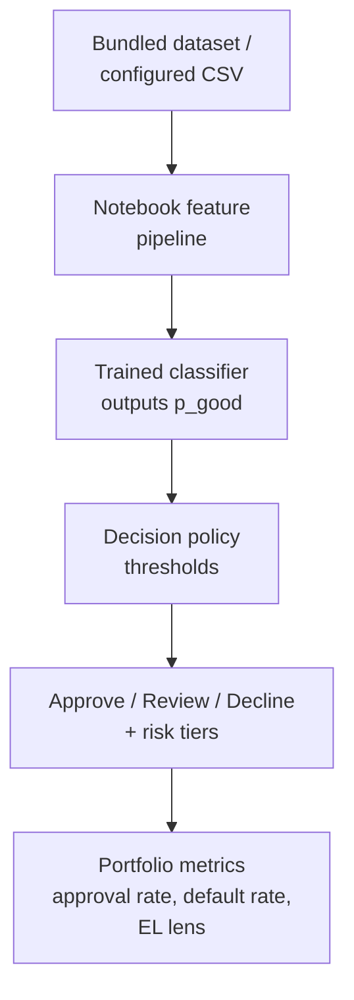

# Credit Risk Decisioning Prototype (Notebook-Based)

## Business Context

Lenders need more than model scores: they need explicit decision rules that balance approval volume and risk outcomes. This **prototype** translates model scores into **illustrative** policy-style rules (tiers, approve/review/decline) and **directional** business interpretation (tradeoff views, SHAP, simple loss framing)—**not** a production policy engine or deployed decision system.

## Problem Statement

- Turn risk scores into **actionable** decisions and **threshold tradeoffs** (approval volume vs default experience among approved).
- Add **explainability** and a **simple, directional** loss lens (clarity over precision).

## Executive Summary

**Observed model efficacy (notebook run on the bundled sample):** A logistic baseline shows **moderate** separation (ROC-AUC ~**0.66**). **Tree models** (Random Forest, XGBoost) reach on the order of **~92% accuracy** with stable CV on that split design. The **interest-rate** regression shows **high R² (~0.92)** on the same sample. These numbers are **illustrative of the pipeline**—re-run after any data or seed change.

**FICO and credit structure (EDA in the notebook):** **`sub_grade` is treated as FICO-like**; **interest rate and `sub_grade` are ~96% correlated**, consistent with **pricing anchored in FICO-like tiers**. **Credit rating dominates the rate model** in line with common practice; **feature importance can differ by target** (e.g. **inquiries** may rank highly for `loan_status` while **`sub_grade` drives rate prediction**).

## System Flow

## Scope, evidence, and limitations

| | |
|--|--|
| **Data** | Default: `data/loans.csv` (~**6.3k** rows, **2014-era** sample). Override with `LENDING_CLUB_DATA_PATH`. README metrics refer to **that artifact** unless you substitute data. |
| **Repro** | Pinned `requirements.txt`; cite **git commit** + **data file** when reporting numbers externally. |
| **What this proves** | Decisioning **machinery** on top of a standard ML notebook—not a validated model for a live book. |
| **Out of scope** | **Not deployed**; no monitoring/governance. Scores are for **ranking/simulation** unless calibrated. Notebook split/CV is **not** an OOT policy sign-off. **EL** is illustrative, not CECL/IFRS 9. Sample is **historical**, not today’s market. |

Charts (**ROC/PR, confusion matrix, threshold sweep, SHAP**) render **in the notebook** when you run cells (no static images checked in—avoids stale assets). For a full executed pass: `pytest --run-notebook` or run the notebook locally.

## Solution Overview

- **Predictive modeling:** ingestion → encoding → scaling → **SMOTE** → classifiers (logistic, KNN, trees, boosting, **XGBoost**); parallel **interest-rate** regression. **No redesign** of the core training workflow in this enhancement.
- **Decision layer:** `src/decisioning.py` + `config/policy.default.yaml` map **P(Fully Paid)** to **tiers** and **approve / review / decline**; notebook applies this on **`best_model`** test scores.
- **Evaluation:** standard metrics plus **threshold sweep** (approval rate vs default among approved), optional **EL** sketch (avg loan × LGD), **SHAP** global + one local explanation.

## Technical Implementation

| Artifact | Role |
|----------|------|
| `Credit_Underwriting_Decisioning-Lending_Club.ipynb` | End-to-end modeling + decisioning / SHAP / simulation cells |
| `src/decisioning.py` | Tiers, decisions, threshold sweep, simple capital helpers |
| `config/policy.default.yaml` | Policy thresholds and LGD assumptions |
| `scripts/run_decisioning.py` | Apply policy to a `p_good` CSV outside Jupyter |
| `docs/PORTFOLIO_DECISIONING.md` | Stakeholder-oriented decisioning narrative |
| `docs/RUNBOOK.md` | Environment, data snapshot, operations |
| `docs/MODEL_CARD.md` | Scope, data, limitations, reproduction |
| `docs/TESTING.md` | Pytest layers, markers, notebook E2E |
| `requirements.txt` | Pinned dependencies |

## Testing

`pytest` with markers (`unit`, `smoke`, `regression`, `notebook_e2e`): decisioning unit tests, reference-model smoke/regression, notebook schema + optional full `nbconvert` execution. Details: `docs/TESTING.md`.

## Extension Opportunities

- Probability **calibration** and **out-of-time** / unbiased holdout evaluation (see limitations above).
- Survival / time-to-default; **monitoring** (drift, overrides).

## Key Takeaways

- **ML → explicit rules → directional outcomes** without rebuilding the core models.
- **Prototype** for communication and exploration—readable in `README`, notebook, and `docs/PORTFOLIO_DECISIONING.md`.

## Skills Demonstrated

Credit Risk, Underwriting Policy, Machine Learning, Decision Systems, Explainable AI (SHAP), Portfolio Simulation, Python, Product-Oriented Analytics

## Quick start (clone and run)

Python **3.9+**; **CI** uses **3.12**; **3.13** validated locally (Windows).

1. `git clone https://github.com/carjam/credit-underwriting.git` → `cd credit-underwriting`
2. `python -m venv .venv` → activate (`.venv\Scripts\activate` on Windows, `source .venv/bin/activate` on Unix)
3. `pip install -r requirements.txt`
4. `pytest` — usually fast; notebook E2E runs if `CI=true` / `RUN_NOTEBOOK_E2E=1` / `--run-notebook`. Quick skip: `SKIP_NOTEBOOK_E2E=1 pytest` (Unix) or `$env:SKIP_NOTEBOOK_E2E='1'; pytest` (PowerShell)
5. Open `Credit_Underwriting_Decisioning-Lending_Club.ipynb` (default data `data/loans.csv`; or set `LENDING_CLUB_DATA_PATH`)
6. Optional: `pytest --run-notebook` · `python scripts/run_decisioning.py --scores-csv your.csv --policy config/policy.default.yaml`

More detail: `docs/RUNBOOK.md`.
