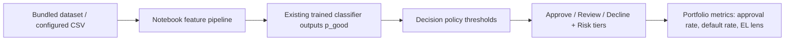

# Credit Risk Decisioning Prototype (Notebook-Based)

## Executive Summary

This repository contains a notebook-based credit underwriting workflow with an added decisioning layer. It reuses existing model outputs to demonstrate **approval thresholds**, **risk tiers**, **decision mapping** (approve / review / decline), a **threshold tradeoff simulation** (approval rate vs default rate among approved), **SHAP explainability**, and a **simple directional loss framing** (avg loan size + LGD assumptions).

**Observed model efficacy (notebook run on the bundled sample):** A simple logistic baseline shows **moderate rank ordering** on the test split (ROC-AUC around **0.66**—better than random, not near-perfect). **Tree-based models** (Random Forest and XGBoost) reach on the order of **~92% accuracy** with **stable cross-validation** on that workflow’s train/test design. The parallel **interest-rate** regression achieves a **high R² (~0.92)** on the same sample. These figures are **illustrative of the pipeline**, not a guarantee on other files or vintages—re-run cells after any data or seed change.

**FICO and credit structure (EDA in the notebook):** **Lending Club `sub_grade` is treated as FICO-like (binned credit quality)**; **interest rate and `sub_grade` are ~96% correlated**, consistent with **posted pricing being heavily anchored in FICO-like tiers** (the remaining spread still matters competitively). The notebook also notes that **credit rating dominates the interest-rate model** in line with long industry use of FICO-style scores, while **feature-importance rankings can differ by target** (e.g., **inquiries** can rank highly for `loan_status` even when **`sub_grade` is central to rate prediction**).

## System Flow

## Evidence, scope, and reproduction

- **Data (default):** `data/loans.csv` — public Lending Club–style **sample** (~**6.3k** rows; **2014-era** issue dates in the bundled file). Metrics in this README refer to **analysis on that artifact** unless you substitute another CSV via `LENDING_CLUB_DATA_PATH`.
- **Code state:** dependencies are **pinned** in `requirements.txt`; **git commit** identifies the exact notebook and `src/` logic. Record both **commit** and **data file** when citing numbers externally.
- **What this repo proves:** decisioning and reporting **machinery** (tiers, thresholds, SHAP, simple EL framing) on top of a standard ML workflow—not a validated production model for a live book.

## Limitations

- **Not deployed:** prototype notebook + library code; no online decision service, monitoring, or governance workflow.
- **Calibration:** treat classifier outputs as **scores for ranking and policy simulation** unless you add explicit calibration; do **not** interpret raw `predict_proba` as a validated regulatory default probability.
- **Validation:** in-notebook split/CV as implemented; **not** a substitute for out-of-time or unbiased holdout design for policy sign-off.
- **Capital / EL:** illustrative **single-period** lens only—not CECL, IFRS 9, or regulatory capital.
- **Data:** historical public sample; **not** representative of current Lending Club or any specific institution today.

## Demo (where to see outputs)

Charts and tables (**ROC/PR, confusion matrix, threshold sweep, SHAP**) are produced **inside the notebook** when cells are run. Static plot images are **not** checked into the repo (avoids stale screenshots); run the notebook locally or use `pytest --run-notebook` for an executed copy.

## Business Context

Lenders need more than model scores: they need explicit decision rules that balance approval volume and risk outcomes. This project focuses on translating model output into policy-style decisions and directional business interpretation.

## Problem Statement

- Convert risk scores into actionable underwriting decisions.
- Surface threshold tradeoffs: stricter approvals vs approval volume and observed default rate among approved.
- Add explainability artifacts for model transparency.
- Provide a simple, directional business-loss lens (clarity over precision).

## Solution Overview:

### Predictive modeling

- Existing notebook pipeline: ingestion, cleaning, encoding, scaling, **SMOTE**, and comparison of classifiers (e.g., Logistic Regression, KNN, Random Forest, XGBoost, boosted variants).
- Secondary **interest-rate** regression track for pricing context.
- **No model redesign** in this enhancement: existing trained-model workflow is reused.

### Decision layer

- **`src/decisioning.py`**: maps **P(Fully Paid)** to **prime / near-prime / subprime** tiers and to **approve / review / decline** using configurable thresholds.
- Notebook cells apply these rules on top of **`best_model`** scores on the test split.

### Evaluation framework

- Original metrics: confusion matrix, precision, recall, F1, ROC-AUC, ROC / PR plots.
- **Added**: threshold sweep with **approval rate** and **default rate among approved**, plus optional **expected loss per approved loan** using assumed **average loan amount** and **LGD**.
- **SHAP**: global importance (beeswarm/summary) and one **individual** explanation (waterfall-style where supported).

## Technical Implementation

| Artifact | Role |
|----------|------|
| `Credit_Underwriting_Decisioning-Lending_Club.ipynb` | Existing modeling workflow + added decisioning/simulation/SHAP cells |
| `src/decisioning.py` | Decision tiers, actions, threshold sweep, simple capital helpers |
| `config/policy.default.yaml` | Configurable decision/risk thresholds and LGD assumptions |
| `scripts/run_decisioning.py` | CLI path to apply decision policy outside Jupyter |
| `docs/PORTFOLIO_DECISIONING.md` | Stakeholder-oriented description of the decisioning add-on |
| `docs/RUNBOOK.md` | Day-2 operations: environment, data snapshot, and execution steps |
| `docs/MODEL_CARD.md` | Concise scope, data, limitations, and reproduction (quant-doc “model card lite”) |
| `docs/TESTING.md` | Testing and regression workflow documentation |
| `requirements.txt` | Pinned dependencies for reproducible local/CI runs |

## Testing and Regression Framework

- `pytest`-based test suite with strict markers (`unit`, `smoke`, `regression`, `notebook_e2e`)
- Unit coverage for decision-layer logic in `src/decisioning.py`
- Notebook **schema** checks plus bundled `data/loans.csv` presence; optional **full execution** via `nbconvert` (see `docs/TESTING.md`)
- Deterministic model smoke test to ensure ML pipeline health in local environment
- Baseline-driven regression test using `tests/baselines/model_quality_baseline.json`
- See `docs/TESTING.md` for run commands and baseline update workflow

## Business Impact (Modeled)

Directional, offline illustration only (not production evidence):

- Clearer policy levers (thresholds and tiers) tied to model scores.
- Tradeoff view linking approval volume to default experience among approved loans.
- Explainability outputs for internal review and stakeholder communication.
- Illustrative loss lens via EL ≈ default_rate × LGD × average exposure per approved loan (not a CECL/IFRS9/regulatory capital model).

## Extension Opportunities

- Calibrate probabilities before using scores as direct default probabilities.
- Evaluate on unbiased holdout / out-of-time cohorts and report cohort-specific metrics.
- Add survival/time-to-default modeling for multi-period risk views.
- Add monitoring for drift, stability, and manual override patterns.

## Key Takeaways

- Demonstrates **ML → decision rules → directional business outcomes** without rebuilding models.
- Readable by technical and non-technical stakeholders (`README`, notebook, `docs/PORTFOLIO_DECISIONING.md`).
- Purposefully scoped as a prototype for communication and policy exploration, not a deployed decision engine.

## Skills Demonstrated

Credit Risk, Underwriting Policy, Machine Learning, Decision Systems, Explainable AI (SHAP), Portfolio Simulation, Python, Product-Oriented Analytics

## Quick start (clone and run)

Use this section to get a working environment after cloning. Python **3.9+** is supported. **GitHub Actions** runs **Python 3.12**; local validation has also been run on **3.13** (Windows).

1. **Clone and enter the repo**
   - `git clone https://github.com/carjam/CreditUnderwriting.git`
   - `cd CreditUnderwriting`
2. **Create a virtual environment (recommended)**
   - `python -m venv .venv`
   - Windows: `.venv\Scripts\activate`
   - macOS/Linux: `source .venv/bin/activate`
3. **Install dependencies**
   - `pip install -r requirements.txt`
4. **Sanity-check the install**
   - `pytest` (usually fast: full notebook execution is skipped unless `CI=true`, `RUN_NOTEBOOK_E2E=1`, or `--run-notebook`). If your shell inherits `CI=true` and you want a quick check, run `SKIP_NOTEBOOK_E2E=1 pytest` (Unix) or `$env:SKIP_NOTEBOOK_E2E='1'; pytest` (PowerShell).
5. **Run the analysis notebook**
   - Default data: `data/loans.csv` (~6.3k rows, 2014-era sample mirror)
   - Open `Credit_Underwriting_Decisioning-Lending_Club.ipynb` in Jupyter / VS Code and run all cells
   - Or use another CSV: set `LENDING_CLUB_DATA_PATH` to its path before running the data-load cell
6. **Optional: full notebook execution test** (several minutes)
   - `pytest --run-notebook`
7. **Optional: apply decision policy outside Jupyter**
   - Prepare a CSV with a `p_good` column (and optionally `y_true` for default-rate summaries)
   - `python scripts/run_decisioning.py --scores-csv your_scores.csv --policy config/policy.default.yaml`

More detail (data provenance, CI knobs, troubleshooting): `docs/RUNBOOK.md`.
